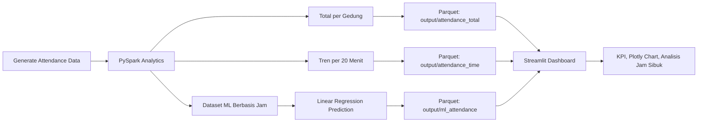
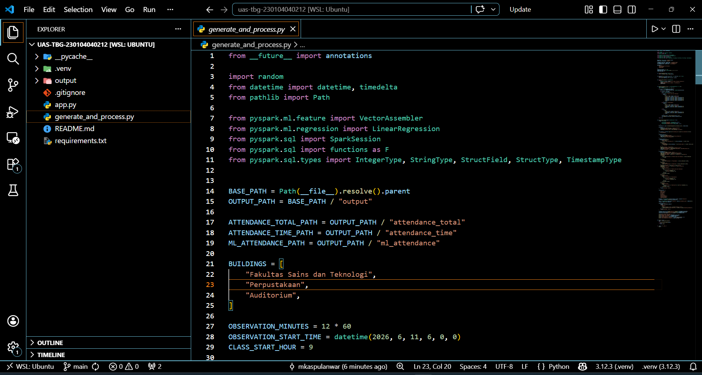
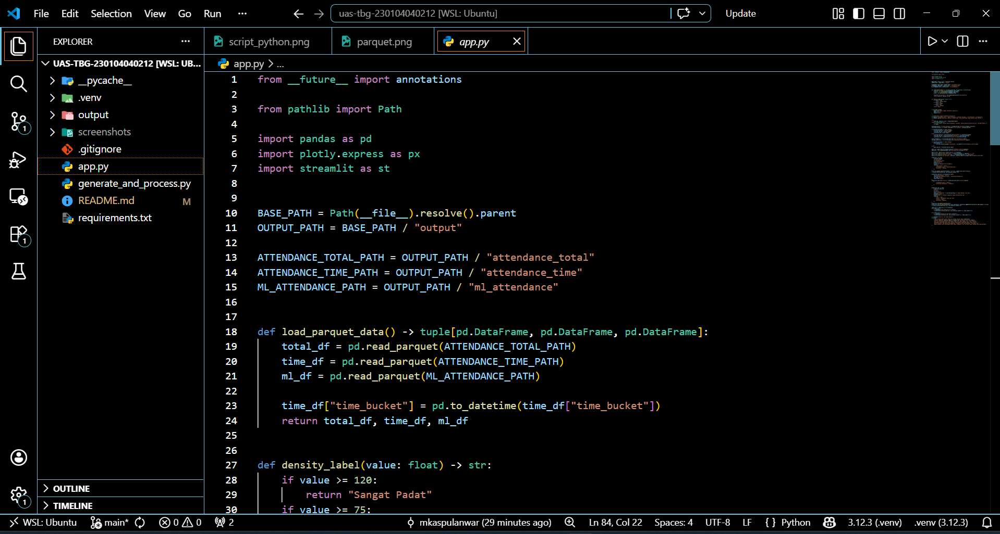
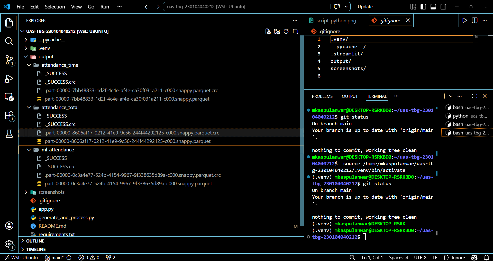
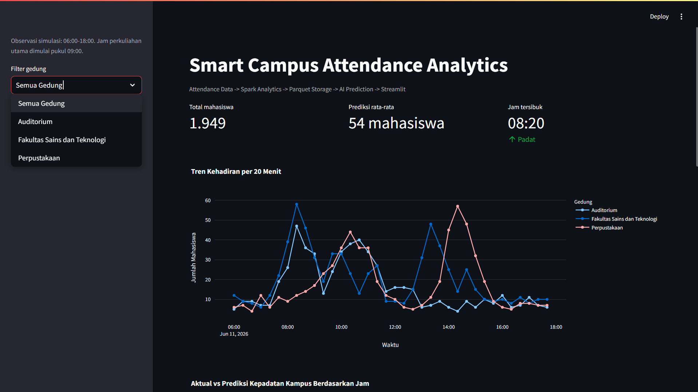
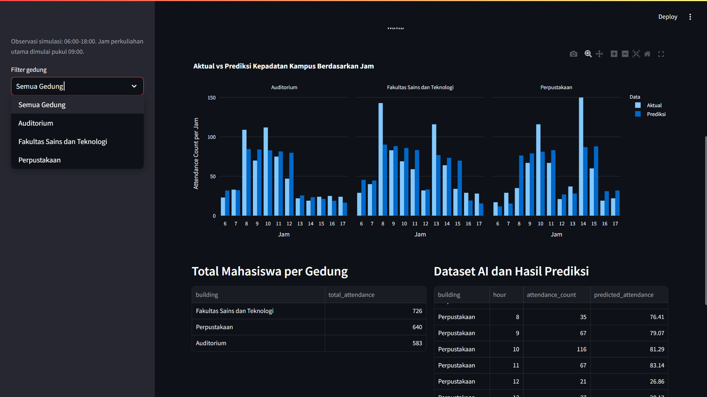
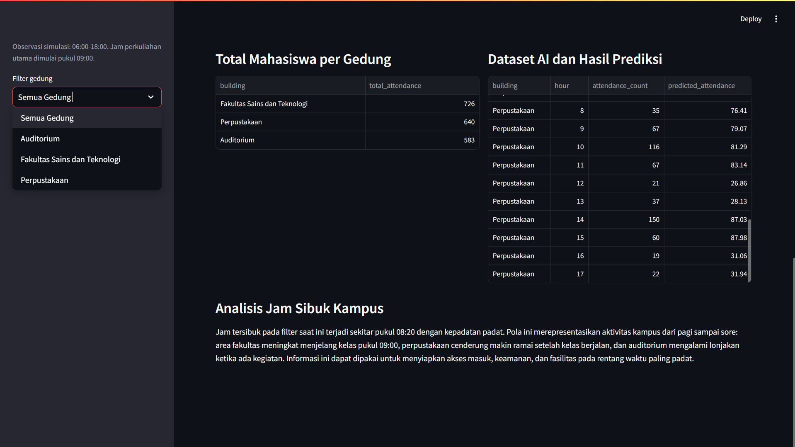

# UAS Teknologi Big Data: Smart Campus Attendance Analytics


## Identitas Project

| Keterangan | Detail |
| :--- | :--- |
| Mata Kuliah | Teknologi Big Data |
| Project | UAS Smart Campus Attendance Analytics |
| Kelas | TI23A |
| Ketentuan Soal | NIM akhir genap |
| Studi Kasus | Analisis kepadatan mahasiswa berdasarkan data tapping kartu mahasiswa |
| Pipeline | Attendance Data -> Spark Analytics -> Parquet Storage -> AI Prediction -> Streamlit |

---

## Ringkasan Project

Project ini membangun pipeline analitik Big Data untuk memantau dan memprediksi kepadatan mahasiswa pada beberapa gedung kampus. Data yang digunakan merupakan data simulasi tapping kartu mahasiswa selama periode observasi pukul 06:00 sampai 18:00.

Data diproses menggunakan PySpark untuk menghasilkan agregasi total mahasiswa per gedung, tren kehadiran per 20 menit, dan dataset machine learning berbasis jam. Hasil transformasi disimpan dalam format Parquet, kemudian divisualisasikan melalui dashboard Streamlit dengan grafik interaktif Plotly dan prediksi kepadatan menggunakan Linear Regression.

## Tujuan Project

1. Membuat data simulasi attendance mahasiswa pada beberapa gedung kampus.
2. Mengolah data attendance menggunakan PySpark.
3. Menyimpan hasil pengolahan ke format Parquet.
4. Membuat dashboard interaktif menggunakan Streamlit dan Plotly.
5. Membangun prediksi kepadatan kampus menggunakan Linear Regression.
6. Menganalisis jam sibuk kampus berdasarkan tren kehadiran dan hasil prediksi.

## Cakupan Fitur

1. Generate data simulasi tapping mahasiswa dari pukul 06:00 sampai 18:00.
2. Pola aktivitas realistis berdasarkan sesi perkuliahan, perpustakaan, dan auditorium.
3. Spark transformation untuk total mahasiswa per gedung.
4. Spark transformation untuk tren kehadiran per 20 menit.
5. Dataset machine learning berbasis jam.
6. Penyimpanan output utama menggunakan Parquet.
7. Dashboard Streamlit dengan sidebar filter gedung.
8. KPI total mahasiswa, prediksi rata-rata, dan jam tersibuk.
9. Grafik tren kehadiran per 20 menit menggunakan Plotly.
10. Grafik aktual vs prediksi kepadatan per jam.

## Pola Simulasi Data

Simulasi dibuat agar pola kepadatan lebih mudah dipahami dan tidak hanya berupa angka acak.

1. **Fakultas Sains dan Teknologi**
   - Sesi 1: 08:30-10:00
   - Sesi 2: 10:00-11:30
   - Sesi 3: 13:30-15:00
   - Setelah sesi perkuliahan selesai, kepadatan menurun.

2. **Perpustakaan**
   - Sesi ramai pagi: 08:30-11:30
   - Sesi ramai siang/sore: 14:00-15:30
   - Setelah itu kepadatan cenderung turun.

3. **Auditorium**
   - Simulasi acara dari 08:30-13:00
   - Setelah acara selesai, area auditorium menjadi lebih sepi.

## Arsitektur Pipeline



## Struktur Project

```bash
uas-tbg-230104040212/
├── app.py                            # Dashboard Streamlit
├── generate_and_process.py           # Generate data, Spark processing, Parquet, ML
├── requirements.txt                  # Dependency Python
├── README.md                         # Dokumentasi project
├── screenshots/                      # Folder bukti screenshot UAS
│   ├── dashboard.png                 # Screenshot dashboard
│   ├── parquet_output.png            # Screenshot output Parquet
│   └── spark_run.png                 # Screenshot Spark berhasil dijalankan
└── output/                           # Output utama berbasis Parquet
    ├── attendance_total/             # Total mahasiswa per gedung
    ├── attendance_time/              # Tren kehadiran per 20 menit
    └── ml_attendance/                # Dataset AI dan hasil prediksi
```

## Skema Data

### 1) Data Attendance Mentah

| Kolom | Tipe | Deskripsi |
| :--- | :--- | :--- |
| `timestamp` | timestamp | Waktu tapping kartu mahasiswa |
| `building` | string | Nama gedung kampus |
| `attendance_count` | integer | Jumlah tapping mahasiswa pada waktu tersebut |

### 2) Output `attendance_total`

| Kolom | Tipe | Deskripsi |
| :--- | :--- | :--- |
| `building` | string | Nama gedung |
| `total_attendance` | integer | Total attendance per gedung |

### 3) Output `attendance_time`

| Kolom | Tipe | Deskripsi |
| :--- | :--- | :--- |
| `building` | string | Nama gedung |
| `time_bucket` | string | Kelompok waktu per 20 menit |
| `attendance_count` | integer | Total attendance pada interval 20 menit |

### 4) Output `ml_attendance`

| Kolom | Tipe | Deskripsi |
| :--- | :--- | :--- |
| `building` | string | Nama gedung |
| `hour` | integer | Jam observasi |
| `attendance_count` | double | Total attendance aktual per jam |
| `predicted_attendance` | double | Hasil prediksi Linear Regression |

## Teknologi yang Digunakan

| Teknologi | Fungsi |
| :--- | :--- |
| Python | Bahasa utama project |
| PySpark | Generate DataFrame, transformasi, agregasi, dan machine learning |
| Parquet | Format penyimpanan output utama |
| Streamlit | Dashboard interaktif |
| Plotly | Visualisasi grafik interaktif |
| Linear Regression | Model prediksi kepadatan berdasarkan jam dan fitur sesi |

## Setup Environment

### 1) Prasyarat

1. WSL Ubuntu atau Linux environment.
2. Python 3.10+.
3. Java 8/11+ untuk menjalankan Spark.
4. Virtual environment Python.

### 2) Masuk ke Folder Project

```bash
cd /home/mkaspulanwar/uas-tbg-230104040212
```

### 3) Membuat Virtual Environment

```bash
python3 -m venv .venv
source .venv/bin/activate
```

### 4) Install Dependency

```bash
pip install -r requirements.txt
```

## Cara Menjalankan Project

### 1) Jalankan Pipeline Spark

```bash
python generate_and_process.py
```

Script ini akan:

1. Generate data attendance kampus.
2. Melakukan Spark transformation.
3. Menyimpan output ke folder Parquet.
4. Melatih model Linear Regression.
5. Menyimpan hasil prediksi ke `output/ml_attendance`.

Jika berhasil, terminal akan menampilkan informasi seperti:

```text
Spark berhasil dijalankan.
Parquet total mahasiswa: /home/mkaspulanwar/uas-tbg-230104040212/output/attendance_total
Parquet tren 20 menit: /home/mkaspulanwar/uas-tbg-230104040212/output/attendance_time
Parquet dataset AI: /home/mkaspulanwar/uas-tbg-230104040212/output/ml_attendance
```

### 2) Jalankan Dashboard Streamlit

```bash
streamlit run app.py
```

Dashboard dapat dibuka melalui:

```text
http://localhost:8501
```

## Quick Run

Jika virtual environment sudah dibuat dan dependency sudah terinstall:

```bash
cd /home/mkaspulanwar/uas-tbg-230104040212
source .venv/bin/activate
python generate_and_process.py
streamlit run app.py
```

## Validasi Keberhasilan

Project dianggap berhasil jika:

1. Script `generate_and_process.py` berhasil dijalankan tanpa error.
2. Folder `output/attendance_total` berhasil dibuat.
3. Folder `output/attendance_time` berhasil dibuat.
4. Folder `output/ml_attendance` berhasil dibuat.
5. File Parquet dapat dibaca ulang oleh dashboard.
6. Dashboard Streamlit berjalan di `localhost:8501`.
7. Grafik Plotly tampil pada dashboard.
8. Sidebar filter gedung dapat digunakan.
9. Prediksi Linear Regression muncul pada grafik aktual vs prediksi.

## Hasil Akhir Data

Berdasarkan output final, total attendance seluruh gedung adalah 1.949 mahasiswa.

| Gedung | Total Attendance |
| :--- | ---: |
| Fakultas Sains dan Teknologi | 726 |
| Perpustakaan | 640 |
| Auditorium | 583 |

Jam tersibuk kampus berdasarkan agregasi semua gedung terjadi pada pukul 08:20 dengan total attendance 117 mahasiswa dalam interval 20 menit.

## Analisis Jam Sibuk Kampus

Berdasarkan hasil pengolahan data Smart Campus Attendance Analytics, total kehadiran mahasiswa selama periode observasi pukul 06:00 sampai 18:00 adalah 1.949 mahasiswa. Jumlah tersebut berasal dari tiga lokasi utama, yaitu Fakultas Sains dan Teknologi sebanyak 726 mahasiswa, Perpustakaan sebanyak 640 mahasiswa, dan Auditorium sebanyak 583 mahasiswa.

Dari hasil agregasi tren kehadiran per 20 menit, jam tersibuk kampus terjadi pada pukul 08:20 dengan total attendance_count sebesar 117 mahasiswa. Periode ini menjadi waktu paling padat karena mendekati awal aktivitas perkuliahan pagi, khususnya sesi pertama yang dimulai sekitar pukul 08:30 sampai 10:00.

Pada Fakultas Sains dan Teknologi, kepadatan tertinggi terjadi pada pukul 08:20 dengan attendance_count sebesar 58 mahasiswa dalam interval 20 menit. Hal ini menunjukkan bahwa area fakultas paling ramai sebelum dan saat awal perkuliahan dimulai.

Pada Perpustakaan, kepadatan tertinggi terjadi pada pukul 14:20 dengan attendance_count sebesar 57 mahasiswa dalam interval 20 menit. Hal ini menunjukkan bahwa perpustakaan lebih ramai pada sesi siang hingga sore, khususnya setelah aktivitas kelas selesai atau saat mahasiswa menggunakan waktu kosong untuk belajar.

Pada Auditorium, kepadatan tertinggi terjadi pada pukul 08:20 dengan attendance_count sebesar 47 mahasiswa dalam interval 20 menit. Pola ini menunjukkan adanya aktivitas atau acara kampus pada pagi hari. Setelah rentang acara selesai, jumlah kehadiran di auditorium cenderung menurun.

## Analisis Prediksi

Model prediksi menggunakan Linear Regression dari PySpark ML. Prediksi tidak hanya menggunakan fitur `hour` mentah, tetapi juga fitur turunan seperti `hour_squared`, `hour_cubed`, fitur gedung, dan fitur sesi aktivitas. Pendekatan ini tetap memenuhi ketentuan Linear Regression, tetapi hasilnya lebih mampu mengikuti pola kepadatan yang tidak sepenuhnya linear.

Hasil prediksi menunjukkan bahwa Fakultas Sains dan Teknologi dan Auditorium memiliki kepadatan tinggi pada pagi hari, sedangkan Perpustakaan cenderung meningkat pada siang hingga sore hari. Hal ini sesuai dengan pola aktivitas kampus: perkuliahan dimulai pagi, auditorium ramai saat ada kegiatan, dan perpustakaan lebih ramai setelah mahasiswa menjalani aktivitas kelas.

## Bukti Screenshot UAS

Simpan bukti screenshot pada folder `screenshots/`.

<table>
<tr>
<td align="center"><b>Script Python</b></td>
<td align="center"><b>Script Dashboard</b></td>
<td align="center"><b>Screenshots Parquet</b></td>
</tr>
<tr>
<td></td>
<td></td>
<td></td>
</tr>
<tr>
<td align="center"><b>Dashboard 1</b></td>
<td align="center"><b>Dashboard 2</b></td>
<td align="center"><b>Dashboard 3</b></td>
</tr>
<tr>
<td></td>
<td></td>
<td></td>
</tr>
</table>

## Troubleshooting

1. Jika muncul error PySpark terkait Java, pastikan Java sudah terinstall:

```bash
java -version
```

2. Jika dashboard menampilkan Parquet belum ditemukan, jalankan pipeline terlebih dahulu:

```bash
python generate_and_process.py
```

3. Jika Streamlit tidak terbuka, jalankan ulang:

```bash
streamlit run app.py
```

4. Jika grafik belum berubah setelah regenerate data, refresh browser atau tekan tombol `Rerun` di Streamlit.

5. Jika dependency belum tersedia, install ulang:

```bash
pip install -r requirements.txt
```

## Keterbatasan Implementasi

1. Data attendance merupakan data simulasi, bukan data tapping kartu mahasiswa asli.
2. Model Linear Regression digunakan untuk memenuhi ketentuan UAS, sehingga hasil prediksi bersifat demonstratif.
3. Belum menggunakan sistem streaming real-time seperti Kafka atau Spark Structured Streaming.
4. Belum ada database permanen di luar Parquet.
5. Belum ada autentikasi pengguna pada dashboard.

## Rencana Pengembangan

1. Menghubungkan data tapping kartu mahasiswa secara real-time.
2. Menambahkan Kafka untuk ingestion streaming.
3. Menambahkan model prediksi yang lebih kompleks seperti Random Forest atau Gradient Boosting.
4. Menambahkan alert otomatis saat kepadatan melebihi threshold.
5. Menambahkan filter tanggal dan rentang waktu pada dashboard.

## Penutup

Project Smart Campus Attendance Analytics berhasil membangun pipeline Big Data end-to-end mulai dari generate data, Spark analytics, penyimpanan Parquet, prediksi AI, hingga dashboard Streamlit. Hasil akhir dapat digunakan untuk memahami pola kepadatan kampus, menentukan jam sibuk, dan mendukung pengambilan keputusan operasional seperti pengaturan akses gedung, keamanan, dan fasilitas kampus.
